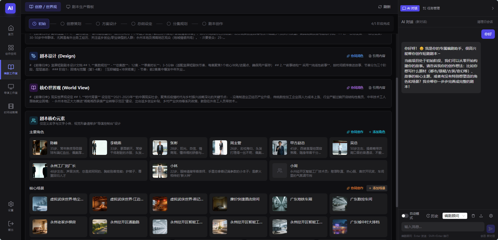

# AI Cine Studio

> **AI-Native · Local-First · Cloud-Powered** — An all-in-one integrated creative environment designed for short drama and film creators.

---

## 🎬 Overview

In the world of AI video creation, have you experienced this frustration: writing scripts in ChatGPT, generating images in Midjourney, creating videos in Runway, then importing everything into editing software to piece together — fragmented tools, chaotic asset management, inconsistent styles, and low efficiency?

**AI Cine Studio** changes all of that.



This is an **"AI-native" desktop-level film & TV creation IDE** that integrates the entire workflow — scriptwriting, character design, storyboard planning, AI video generation, timeline editing, audio engineering, and final export — into a single unified workspace. You focus on creativity; we handle the rest.

---

## 🌍 Languages

- [English](README.md)
- [中文](README_cn.md)

---

## ✨ Core Value Propositions

### 🏗️ Structured Creation
A mandatory "Script → Storyboard → Asset" hierarchical management system that fundamentally solves the randomness problem of AI-generated content. Every step is traceable, every asset has its place.

### 💰 Cost-Effective & Efficient
Our独创 **"Static Pre-viz" workflow** — first build the complete story rhythm with storyboard images + auto-generated voiceover, then invest in AI video generation only after you're satisfied. **Rehearse first, generate later**, dramatically reducing compute costs.

### 📚 Industrial-Grade Version Management
Introducing **"Version Stacking"** — multiple generations of the same shot are preserved as v1, v2, v3... allowing instant comparison and switching. No recycle bin, only infinite possibilities — encourage bold experimentation, never lose a creative idea.

### 🤖 AI Conversation-Driven
A persistent AI chat panel on the right side, supporting two AI roles: **Script Advisor** and **Visual Director**. Describe your needs in natural language, and the AI automatically executes scriptwriting, character generation, storyboard design, video generation, and more. **Conversation is operation**.

---

## 🖥️ Workspace

The product uses a **three-column layout** for a clear creative workflow:

```
┌──────────┬───────────────────────────────┬──────────────────┐
│ Resource │        Dynamic View Area       │   AI Chat Panel   │
│ Tree     │                               │  or Task Manager  │
│          │  Writer's Room / Director Ctrl │                  │
│          │  Timeline Edit / Asset Preview │  Persistent Right │
└──────────┴───────────────────────────────┴──────────────────┘
```

### 📝 Writer's Room (编剧工作室) — From Inspiration to Script

A creative space designed for the full lifecycle of scriptwriting:

- **5-Stage Workflow Guidance**: Creative Planning → Scheme Design → Outline Setting → Episode Planning → Script Writing — AI automatically advances stages
- **Creative/Worldview View**: Manage script proposals, world-building, core characters and scenes, with knowledge base feeding
- **Script Production Board**: Manage all episodes in a card grid, click any card to enter episode-level editing
- **Episode Editing Three-Column Layout**:
  - Left: Action Beats broken down by timeline
  - Center: Standard script format text editor
  - Right: AI-assisted context panel
- **One-Click AI Assistance**: Beat generation, script generation, self-check — click to send to the AI chat panel for execution

### 🎥 Director Console (导演控制台) — From Text to Visuals

A professional workstation for transforming text scripts into visual assets:

- **Visual Setup**:
  - Global visual tone management (style, color, lighting, texture)
  - **Style Library System**: 7+ built-in preset styles (Eastern Historical Costume, Western Live-Action Film, 3D Fantasy, 2D Japanese Anime, Eastern Nostalgic Wuxia, 80s Hong Kong Retro, etc.), with user custom style support
  - Casting & Makeup: Batch generate character reference images
  - Location Scouting: Generate visual references for each scene
- **Storyboard Design**: Design storyboards episode by episode, with `@Character` `@Scene` quick reference
- **Production Floor**:
  - Asset Library (Characters/Scenes)
  - Storyboard Script Editor (supports timecode-based shot segmentation)
  - Real-time preview canvas
  - Bottom horizontal storyboard sequence bar with drag-and-drop sorting and batch operations

### 🎞️ Timeline Editor — Editing & Export

A professional timeline editing tool:

- **Pre-viz Mode**: Lay storyboard images onto the timeline, auto-generate voiceover via TTS for dialogue, and apply Ken Burns camera motion effects on the frontend. **No video generation credits consumed at this stage**.
- **Dimension Upgrade (I2V)**: Select a pre-viz clip, one-click to generate real AI video, automatically injecting character makeup photos for visual consistency
- **Smart Replacement**: Supports "Duration Lock" (auto crop/freeze to match) and "Ripple Replace" (new video duration determines placement)
- **Multi-Track Audio Engineering**: Dialogue Track (TTS) / SFX Track / Music Track (BGM), with auto-ducking mix on export
- **Subtitle System**: Auto-generate SRT subtitles from TTS, burned into video on export

---

## 🤖 AI Conversation System

### Dual-Role AI Assistants

| Role | Expertise | Use Case |
|------|-----------|----------|
| **Script Advisor** | Scriptwriting, character design, story development | Writer's Room |
| **Visual Director** | Visual style, storyboard design, video generation | Director Console |

### Rich Interactive Experience

The AI doesn't just return text — it renders interactive elements right in the conversation:
- 📋 **Selection Cards**: Genre, audience, tone selection
- 📊 **Progress Bars**: Real-time generation progress
- 🖼️ **Asset Cards**: Character/scene information display
- 🎨 **Style Selector**: Visual style grid selection
- 📝 **Form Collection**: Production parameter settings
- 🖼️ **Embedded Image/Video Preview**: Instant view of generated results
- ⚙️ **Tool Call Visualization**: Transparent display of AI execution process

### Personalized Configuration

- Auto-mode toggle (skip confirmations for direct execution)
- Script/storyboard modification auto-confirm
- Overwrite generation / batch update auto-confirm
- Attachment upload (images/videos/files as AI context)
- Session management (up to 50 sessions per project, with rename, delete, and cleanup support)

---

## 🎨 Supported Visual Styles

| Style | Category | Characteristics |
|-------|----------|-----------------|
| Eastern Historical Costume | Realistic | Chinese historical costumes, live-action period drama aesthetics |
| Western Live-Action Film | Realistic | 35mm film grain, natural lighting |
| Eastern Nostalgic Wuxia | Realistic | Low saturation, vintage photo tones |
| 80s Hong Kong Retro | Realistic | Neon signs, film color grading |
| 2D Japanese Anime | 2D Anime | Clean lines, cel-shaded coloring |
| 2D Anime | 2D Anime | Bright colors, flat gradient shading |
| 3D Fantasy | 3D Anime | Xianxia cultivation, grand scenes |
| Custom Style | Custom | Create your own exclusive style |

---

## 📐 Aspect Ratios & Export

### Supported Aspect Ratios
- **Portrait 9:16**: 1080 × 1920 (TikTok/Kuaishou/WeChat Channels)
- **Landscape 16:9**: 1920 × 1080 (Bilibili/YouTube/Xigua Video)
- **Square 1:1**: 1080 × 1080

### Export Specifications
- **Format**: MP4 (H.264 / H.265)
- **Resolution**: Locked to the project's creation resolution
- **Bitrate**: High / Medium / Low — three tiers
- **Audio**: Auto-ducking mix
- **Subtitles**: SRT burn-in

---

## 💳 Business Model

### Membership Subscription
- **Annual Membership**: ¥30,000/year, includes 300,000 credits
- **Trial Mode**: Non-members can trial for half a month, up to 6 hours per day

### Credit Consumption
- **Platform Models**: Use built-in Sora / Seedance / Doubao models — credits deducted via cloud Proxy authentication
- **Bring Your Own Key (BYO)**: Enter your own API Key in settings — the system charges a small processing fee per use

### Risk Protection
- "Estimated credit consumption" confirmation dialog before batch generation
- Credits refunded only on API failure or system crash

---

## 🚀 Quick Start

### System Requirements
- **OS**: Windows 10/11 (64-bit) / Linux (x86_64 / ARM64)
- **Browser**: Chrome 90+ or Edge 90+
- **RAM**: 8GB+ recommended
- **Storage**: 10GB+ free space recommended for asset storage
- **Network**: Internet connection required for AI services

### Installation

**Windows Users**:
1. Download and extract `AI Cine Studio`
2. Double-click the launch batch file to start
3. The browser will automatically open to the creative interface

**Linux Users**:
```bash
# Install FFmpeg (if not already installed)
./install.sh

# Start the service
./start.sh
```

After launch, your browser will automatically open to `http://127.0.0.1:9900` to begin creating.

### First-Time Workflow
1. **Login/Register**: Verify membership status
2. **Create Project**: Choose aspect ratio (portrait/landscape), enter project name
3. **Configure AI Models**: Use platform models or enter your own API Key
4. **Start Creating**: Begin your creative journey from the Writer's Room or AI Chat

---

## 📖 Creative Workflow Overview

```
1. Ideation ──→ 2. Script Generation ──→ 3. Character Casting ──→ 4. Storyboard Design
                                                           │
7. Export ←── 6. Video Generation ←── 5. Pre-viz Confirmation ←── 5. Static Pre-viz
```

1. **Ideation**: Define genre, worldview, characters, and scenes in the Writer's Room
2. **Script Generation**: AI-assisted episode outlines, action beats, and script body
3. **Character Casting**: Generate character makeup photos in the Director Console as "consistency anchors" for subsequent video generation
4. **Storyboard Design**: Design storyboards and visuals episode by episode
5. **Static Pre-viz**: One-click lay storyboards onto timeline + auto voiceover, quickly validate pacing
6. **Video Generation**: Select approved storyboards, upgrade to AI-generated video
7. **Edit & Export**: Fine-tune on the timeline, add SFX/music/subtitles, export final MP4

---

## 🔧 Global Settings

- **Model Configuration**:
  - Platform Models: View remaining credits, select built-in models
  - Custom Models: Configure BaseURL, API Key, model name
- **Network Proxy**: HTTP proxy settings for accessing AI APIs from regions with restricted access

---

## 📚 Documentation

- [User Manual](docs/user/) — Detailed product usage guide
- [Admin Manual](docs/admin/) — Deployment and operations guide
- [Technical Docs](docs/technical/) — Architecture and development reference

---

## 📞 Support & Feedback

For any questions or suggestions, feel free to reach out:
- Website: [zyinfo.pro/cine-studio](https://zyinfo.pro/cine-studio)
- WeChat: youkpan
- Email: pyq@zyinfo.pro
- In-product feedback entry
- Official community

---

## ⚖️ License & Disclaimer

This product is commercial software requiring a membership subscription for full use. Trial functionality is limited.

All AI-generated content copyrights belong to the user.

---

**AI Cine Studio** — Where every frame comes from imagination, and every second is within reach.
